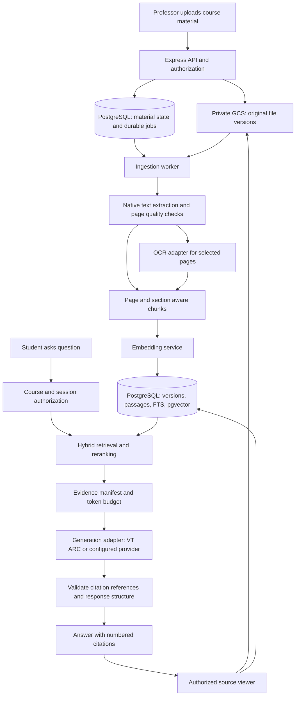

# Production Course RAG Implementation Plan

> **September 16 scope update:** The owner approved implementation on `dev` after reviewing [the task breakdown](2026-09-16-rag-implementation-tasks.md), with OCR disabled. OCR integration, hosting, benchmarks, and scanned-document acceptance gates below are deferred. The implementation exposes unusable/incomplete native extraction explicitly. See [setup and operations](../production-rag.md) for the delivered code, rollout controls, and remaining validation gates. No live backfill or deployment has run.

## Recommendation and approval scope

Build a document-grounded course assistant around the existing PostgreSQL/pgvector database and Google Cloud Storage (GCS). Keep the React and Express applications. Add durable ingestion, immutable document versions, hybrid retrieval, and citations that open the actual supporting passage. Replace student-facing Trust, Validation, Fact-check, and heuristic confidence percentages with source references and clear descriptions of missing evidence.

Target a **department pilot: tens of courses and hundreds of students**. Use one application backend, a separate worker process, and an optional OCR service. Scale these components independently when measurements justify it. A graph database, separate vector database, agent framework, and Kubernetes are unnecessary for the initial scope.

**Status: original research plan; application implementation approved September 16 with OCR deferred.** The code is being delivered on `dev`; live database contents, infrastructure, and environment settings have not been changed. Research checked on September 14, 2026. Recommendations below are engineering judgments; externally established facts have numbered source links. Capacity and quality targets remain proposed acceptance criteria, not measured results.

| Decision | Proposed choice |
|---|---|
| Source of answers | Authorized, published course materials; abstain when they do not support an answer |
| File storage | Existing private GCS bucket, immutable object names and recorded generations |
| Search | pgvector plus PostgreSQL full-text search, rank fusion, then an optional cross-encoder |
| Embeddings | Preserve the current 768-dimensional configuration initially; benchmark changes separately |
| Citations | Server-owned passage IDs, document versions, source excerpts, and page/section links |
| Scores | Remove answer percentages and automatic jury/fact-check calls from course chat |
| Generation | Add a VT ARC adapter; activate after credential and deployment checks |
| OCR | Preserve the sidecar boundary, correct Unlimited-OCR integration, compare with managed OCR |
| Migration | Reprocess existing course attachments into a new index; retain the previous index for rollback |

## 1. What enterprise implementations support

Public engineering accounts describe patterns and tradeoffs, not a universal enterprise RAG configuration. Their results do not establish what this LMS will achieve.

| Evidence | What the company documents | Application to this LMS |
|---|---|---|
| Slack production architecture | Retrieval follows the requesting user's existing permissions; derived answers participate in data lifecycle controls. [1](https://slack.engineering/how-we-built-slack-ai-to-be-secure-and-private/) | Reuse course membership and material visibility checks before retrieval, before generation, and when opening citations. Invalidate derived answers when required by deletion or access changes. |
| Dropbox Dash production experience | Retrieval and reranking trade quality against latency, cost, and freshness. [2](https://dropbox.tech/machine-learning/building-dash-rag-multi-step-ai-agents-business-users) | Invest in retrieval quality and ingestion status before adding autonomous search loops. |
| Dropbox context engineering | A unified retrieval interface reduced unreliable selection among many source-specific tools. [3](https://dropbox.tech/machine-learning/how-dash-uses-context-engineering-for-smarter-ai) | Expose one authorized course-search service to the answer pipeline. |
| Dropbox evaluation practice | Representative datasets and evaluation of answer quality, citations, and latency are central to maintaining quality. [4](https://dropbox.tech/machine-learning/practical-blueprint-evaluating-conversational-ai-at-scale-dash) | Build an instructor-reviewed course evaluation set and run it before changing extraction, embeddings, prompts, or models. |
| Anthropic retrieval experiments | Combining contextualized chunks, lexical search, and reranking improved retrieval on its evaluation datasets. This is vendor experimental evidence. [5](https://www.anthropic.com/engineering/contextual-retrieval) | Test hybrid retrieval and document context. Begin with deterministic titles/headings; add generated chunk context only if it improves held-out results. |
| Microsoft architecture guidance | Supports combining keyword and vector retrieval, reciprocal rank fusion (RRF), and subsequent reranking. [6](https://learn.microsoft.com/en-us/azure/architecture/ai-ml/guide/rag/rag-information-retrieval) | Implement those stages in the existing database and service layer. Azure AI Search is not required. |

The proposed design adopts these principles while keeping the operational footprint appropriate for a department. Enterprise quality comes from permission enforcement, source traceability, recoverable processing, and measured behavior.

## 2. Current implementation and concrete gaps

Paths are relative to the repository root. These findings come from source inspection; they are not claims about an observed production incident.

| Area | Current behavior | Planned correction |
|---|---|---|
| Upload and indexing | `backend/src/routes/professor.ts` performs GCS upload, extraction, embedding, and inserts inside the upload workflow and a long database transaction. Extraction/embedding failures can still leave a successful upload response. | Commit durable upload/job state quickly; process asynchronously and expose indexing status. |
| Retrieval | `services/vectorSearch.ts` performs course-filtered vector search with a fixed similarity cutoff; there is no lexical retrieval branch. | Hybrid retrieval, access-scoped queries, tunable candidate counts, measured answerability. |
| Context | `config/constants.ts` limits the prompt to six chunks with 600 characters each. | Token-budgeted passages that preserve explanations and table structure. |
| Reranking | `services/rerankerService.ts` loads a local model and scores pairs sequentially, falling back on errors. | Warm model assets, batch where supported, bound execution time, and measure real-model behavior. |
| Strict mode | `SubjectChatbotAgent.ts` gates web search, but both its system prompt and grounded-question instructions permit general knowledge. | Make source policy part of the generation contract, remove contradictory prompts, and add abstention tests. |
| Citations | `extractSources` matches filenames in generated text, deduplicates by material, extracts page numbers from the answer, and derives excerpts from answer sentences. | Store exact retrieved evidence and server-generated citation identities. Multiple passages from one document remain distinct. |
| Citation persistence | The normal chat path passes the student message ID into the chatbot, which stores sources before the assistant message exists. | Persist the assistant answer and its citations together under the assistant message ID. Audit regeneration and historical reads too. |
| Verification | `routes/chat.ts` launches background verification and fact-check promises. Fact-check context comes from the latest five course documents, which can differ from the actual answer evidence. | Remove this answer-scoring pipeline; retain an evidence manifest and internal evaluation. |
| Confidence | Provider implementations adjust confidence using response characteristics; `AgentResponse` also has a default fallback value. | Remove those values from course-answer contracts and user-visible judgments. |
| OCR | `ocr-sidecar/server.py` makes generic vision chat requests; `needsOcr` uses whole-document average words per page. | Model-specific adapters, per-page routing, bounded jobs, and extraction-quality checks. |
| Existing backfill | `scripts/reindexEmbeddings.ts` selects only documents with zero embeddings. Its inspected implementation does not implement the `--all` behavior mentioned in project notes. | A new resumable re-ingestion command that reads original GCS files and creates a new index generation. |
| Evaluation | `backend/eval/retrieval-eval.json` contains two example cases, not a real course benchmark. | Curate and validate a representative dataset before choosing models or announcing quality. |
| VT ARC | `AIServiceFactory.ts` implements Gemini, Groq, and mock; no ARC adapter was found. `VT_ARC_API_KEY` is now present in the backend `.env`. | Add explicit ARC configuration and a provider contract test. Credential validity and live model access remain unverified. |

Retain the existing course-material IDs, folders, enrollments, authentication, GCS integration, and grading review workflow. Student submissions and private grading rubrics must not silently enter the student-accessible course retrieval corpus.

## 3. Architecture and boundaries



Recommended backend modules:

| Module | Responsibility |
|---|---|
| `CourseMaterialAccess` | Determine accessible courses, published versions, and allowed material IDs; used by retrieval and source APIs |
| `MaterialIngestionService` | Record uploads, enqueue work, manage lifecycle and retry actions |
| `IngestionWorker` | Execute extraction/chunking/embedding stages outside HTTP request lifetimes |
| `ExtractionService` | Normalize format-specific output into pages/blocks with locators and quality flags |
| `CourseRetrievalService` | Own lexical/vector queries, fusion, reranking, deduplication, and evidence selection |
| `CourseAnswerService` | Orchestrate authorization, retrieval, source-only generation, citation validation, and persistence |
| `CitationService` | Resolve evidence IDs into immutable passages and authorized viewer locations |
| `GenerationProvider` | Handle transport, capabilities, model selection, cancellation, usage, and provider errors |

Keep these as modules within the existing backend, with a second entry point for the worker. The Python OCR service remains an independently deployed extraction dependency. Local embedding/reranking should run in a bounded worker thread or process so CPU inference cannot monopolize the Express event loop.

## 4. Data model and lifecycle

### 4.1 Material identity and immutable evidence

Extend `course_materials` with visibility/deletion state and a pointer to the currently published retrieval generation. Preserve existing IDs and file paths during migration.

Add the following tables through additive, idempotent migrations:

| Table | Essential fields and invariants |
|---|---|
| `material_versions` | UUID, material ID, immutable GCS object name and generation, SHA-256, MIME type, byte count, creation time; unique material/object generation |
| `material_index_runs` | UUID, version ID, pipeline version, embedding space ID, state, expected/completed pages and chunks, timestamps; a run becomes published only after validation |
| `material_pages` | Run ID, physical page index, optional printed label, text, extraction method/version, quality flags, optional block geometry; unique run/page |
| `material_chunks` | UUID, run ID, material/course IDs, text, heading path, locator, token count, text hash, lexical search vector; stable within an immutable run |
| `chunk_embeddings` | Chunk ID, embedding space ID, `vector(768)` initially; uniqueness on chunk/space and dimension checks |
| `ingestion_jobs` | Run ID, stage, status, attempts, next retry, lease owner/expiry, heartbeat, sanitized error; durable idempotency key |
| `answer_runs` | Assistant message ID, course, retrieved run IDs, evidence manifest, policy/prompt/provider/model versions, state, timings, token usage |
| `answer_citations` | Answer ID, citation number, evidence/chunk IDs, quote offsets, locator snapshot; citation belongs to that answer's evidence manifest |

An embedding space includes model revision, dimension, pooling, normalization, tokenizer, and query-prefix policy. A dimension match alone does not make vectors from different models compatible. Keep raw extracted text separate from any synthetic search-context enrichment.

For the pilot, one publication pointer per material can select an index run. Retrieval must also filter the requested embedding space. A future embedding migration needs a per-course active embedding-space pointer and a readiness gate covering all published materials in that course. Switch the course pointer atomically only when the candidate space is complete.

### 4.2 Durable ingestion

1. Validate upload authorization, declared size, detected MIME type, and parser limits. Generate a UUID-based object path rather than embedding an untrusted filename in the storage path.
2. Record an upload intent in a short transaction; upload the object with a create-only generation precondition; finalize the material version and job atomically in PostgreSQL. Reconcile interrupted intents and orphaned objects. GCS and PostgreSQL do not share a transaction. GCS generation preconditions support safe object-operation retries. [13](https://docs.cloud.google.com/storage/docs/request-preconditions)
3. Return the material and processing state. Display `Queued`, `Processing`, `Ready`, `Needs review`, or `Failed` in Course Materials. A downloadable attachment is not necessarily ready for AI search.
4. A worker claims a job using a short lease transaction, releases the database connection, and performs expensive processing. Persist stage checkpoints, retry transient failures with backoff/jitter, and reclaim expired leases.
5. Store page artifacts, chunks, and embeddings as an unpublished run. Validate page coverage, nonempty text where expected, finite vectors, dimensions, and complete chunk counts.
6. In a short transaction, lock the material, recheck it is not deleted/replaced, and publish the completed run. Increment a course corpus revision for invalidation.

Use at-least-once execution with idempotent writes. A unique stage key alone is insufficient: workers also need lease ownership/fencing checks so an expired worker cannot publish after a replacement worker has completed. Start with a PostgreSQL-backed job table to avoid adding Redis solely for this pilot.

Deletion immediately removes material visibility and prevents new retrieval. Pending jobs are cancelled or made ineligible to publish. Retention policy controls eventual removal of originals and derived artifacts. Citations to removed sources show an unavailable state; cached answers and historical source excerpts require the same access checks. Where an answer contains removed sensitive content, hide or invalidate the answer itself rather than only disabling its link.

## 5. Retrieval and grounded answers

### 5.1 Chunking and extraction contracts

Start experiments around **350–600 tokens per chunk with 50–80 tokens of overlap**, constrained by each embedding model's actual tokenizer limit. These are tuning candidates. Preserve headings, table headers, code blocks, and page boundaries; avoid repeatedly embedding headers and footers. Short but meaningful passages should survive minimum-size rules.

Represent locators according to the source format: PDF page plus optional text offsets/boxes; PPTX slide; DOCX heading and paragraph; spreadsheet sheet and cell range; text/Markdown line or section range. Never invent physical pages for unpaginated formats. A converted PDF is a separately versioned preview, with explicit mapping back to its original source.

For native PDFs, collect reading-order blocks and physical page indices. Keep printed page labels separately. For tables crossing pages, preserve linked table fragments and repeated headers. Diagrams without reliable text remain available for viewing, but answering their visual meaning is a separately evaluated multimodal feature.

### 5.2 Search pipeline

Authorize the session and current course membership first. Resolve optional material/folder selections to authorized published IDs on the server. Apply those predicates inside both retrieval branches, including any neighboring-chunk expansion. Do not trust course IDs or access constraints supplied by an LLM.

Use PostgreSQL full-text search (`tsvector`, GIN, `websearch_to_tsquery`, `ts_rank_cd`) for the lexical branch. PostgreSQL's built-in ranking is not BM25; document the distinction. Preserve identifiers with suitable tokenization and test technical symbols, filenames, course codes, and acronyms. [8](https://www.postgresql.org/docs/current/textsearch-controls.html)

Proposed initial sequence:

1. Search the original question through lexical and vector branches, initially up to 40 candidates each.
2. Fuse rank positions with RRF; deduplicate identical passages. Initially use equal branch weights and fusion constant 60, then tune against held-out questions.
3. Rerank up to 40 combined candidates; retain roughly 6–10 evidence passages within a measured token budget. Prefer answer coverage over an arbitrary per-document diversity cap.
4. Expand to adjacent blocks only where needed, rechecking access and the token budget. Attach heading/file context deterministically.
5. For a conversational follow-up, optionally derive a standalone search query, retain the original question, and search both only if evaluation supports the extra latency. Previous assistant answers never become source evidence.

Keep vector similarities and reranker outputs internal. Remove the global `0.5` cutoff as an assumed universal answerability rule. Thresholds must be calibrated on course data; an empty result can also mean ingestion or provider failure, not absence of knowledge.

### 5.3 pgvector deployment

Retain pgvector. Benchmark exact course-filtered search first and compare it with the current IVFFlat index and HNSW. Approximate indexes can lose recall under selective filtering; pgvector 0.8.0+ offers iterative scans. HNSW/IVFFlat `vector` indexes support up to 2,000 dimensions; `halfvec` indexes support up to 4,000. These are index limits, not the storage limit for ordinary vector values. [7](https://github.com/pgvector/pgvector)

Use measured query plans and recall to choose an index. For small courses an exact scan of authorized chunks may suffice. If HNSW wins, use bounded scan settings and an exact fallback for underfilled results. Keep direct ascending distance expressions and `LIMIT` in ANN queries. Ensure course filtering is preserved in every fallback. Do not partition one table per course until workload measurements justify the extra maintenance.

### 5.4 Source-only generation and abstention

The backend assembles a manifest of the exact passages sent to the model, each with a short evidence ID such as `E1`. Provide the question, bounded conversation context, and those passages under an unambiguous source-only system policy. Retrieved document text is untrusted content; embedded instructions cannot change permissions, enable tools, or override that policy.

A proposed generation contract:

```ts
type CourseAnswerDraft = {
  status: 'answered' | 'partial' | 'insufficient_evidence';
  blocks: Array<{
    text: string;
    evidenceIds: string[];
  }>;
  missingInformation?: string[];
};
```

Use structured output when the selected model supports it; otherwise parse and validate the same JSON contract. Reject unknown evidence IDs and malformed structures. Each substantive factual block needs evidence. Permit at most one bounded repair attempt, then return a useful evidence-only result or abstention. Greeting/formatting text can be handled separately without fabricated citations.

A valid evidence ID proves that a cited passage was supplied. It does **not** prove that the passage entails the generated claim. Instructor-reviewed citation precision/coverage tests remain necessary. A future entailment model can be evaluated as an internal gate, but must not be presented as a truth percentage.

Handle distinct outcomes explicitly: `No supporting passage found`, `Some course materials are still processing`, `Sources disagree`, and `Answer service unavailable`. Do not silently answer from general knowledge when retrieval fails. For partial answers, state what is supported and what remains unanswered.

Put supportive teaching tone into the original generation prompt. Remove the independent emotional rewrite from the course-chat path, or require it to run before final citation validation. No model may rewrite the final answer after its citations have been validated.

## 6. Citations students can actually inspect

Example behavior: an answer ends a factual statement with **[1]**. Clicking it opens a panel showing the filename, document version, page/section, and an excerpt from the stored source. An **Open source** action opens that version at the relevant location. This is feasible with the existing course-material attachments.

The model selects evidence IDs; the server owns material IDs, filenames, page numbers, URLs, quote text, and citation numbering. A filename mentioned in prose is never sufficient to create a citation. Two identically named uploads and two cited pages of the same document must remain distinguishable.

For the pilot, deliver accurate page/section navigation and the exact extracted passage. Use a PDF.js-based viewer for PDFs, with an adjacent text panel for scanned pages. Text highlighting can use validated offsets; precise image overlays require bounding boxes from extraction and should be a later enhancement. OCR text is identified as extracted text, since recognition errors are possible.

Suggested APIs:

| Endpoint | Behavior |
|---|---|
| `GET /api/courses/:courseId/materials/:materialId/processing` | Authorized ingestion status and actionable error summary |
| `POST /api/courses/:courseId/materials/:materialId/reprocess` | Professor/admin-only retry; idempotent job creation |
| `GET /api/chat/messages/:messageId/citations` | Assistant-owned evidence references, reauthorized on read |
| `GET /api/materials/:materialId/versions/:versionId/source` | Authorized original/preview and locator; never accepts an arbitrary object path |

Persist the assistant answer, answer run, and citation rows in one short transaction after generation. Regeneration creates a new answer run using the same pipeline. Reloaded chat and saved content resolve the same canonical citation records.

Prefer an authenticated proxy for the source viewer when immediate access revocation matters. A short-lived signed GCS URL is an acceptable alternative with an explicit expiry window: anyone possessing it can use it until expiry. Never store a signed URL as the permanent citation. [14](https://docs.cloud.google.com/storage/docs/access-control/signed-urls)

## 7. Removing scores without losing quality controls

Remove from course chat:

- Trust/Validation/Fact-check percentages, confidence badges, jury disagreements, and score explainers.
- Automatic two-model jury, cosine answer-validation scoring, and background fact-check requests.
- Polling/endpoints used only for those score results.
- Heuristic provider confidence and score-based answer review decisions.

Update `MessageMetadata.tsx`, `ScoreExplainer.tsx`, frontend types/API methods, `routes/chat.ts`, `SubjectChatbotAgent.ts`, and the relevant provider interfaces together. Check normal answers, regeneration, saved content, history reloads, and quiz generation. Shared interfaces currently require confidence and verification methods, so removing just the UI leaves unnecessary coupling and model calls.

Separate the new `GenerationProvider` contract from grading-specific behavior. Preserve actual assignment grades, rubric points, and professor finalization. Those are domain outputs with a different purpose. Make mock generation explicitly development/test-only; unknown production providers must fail configuration validation rather than silently fabricate a mock answer.

Keep old score columns/tables during the migration window for compatibility, but stop new course-chat writes. Drop obsolete schema/code only in a later cleanup after usage checks. Retain internal retrieval metrics, citation evaluation, latency, ingestion errors, and instructor feedback; these measure the system without assigning a misleading certainty number to each student answer.

## 8. OCR feasibility and deployment decision

**Verdict: OCR is implementable; the current sidecar is a useful prototype boundary, but it is not production-ready as written.** Model feasibility is documented; successful operation on the actual deployment hardware remains to be demonstrated.

Unlimited-OCR exists and has published source and serving guidance. [10](https://github.com/baidu/Unlimited-OCR) Its vLLM recipe specifies a dedicated image, a literal `<image>` prompt prefix, a custom n-gram logits processor, `skip_special_tokens: false`, and request-level processor arguments. The recipe advertises at least 8 GB VRAM for BF16 inference; this is not a throughput guarantee. [11](https://recipes.vllm.ai/baidu/Unlimited-OCR)

The local wrapper omits those request/server requirements and uses a generic Markdown prompt. Correct its model adapter and deployment recipe before evaluating output quality. Preserve raw output as an internal artifact and normalize its markup through a tested parser. Pin model and container revisions after a successful real-model smoke test.

Additional code-level issues to address:

| Current limitation | Required behavior |
|---|---|
| Whole-document average words/page | Route individual pages; a text-heavy first page must not hide scanned pages later in the document |
| Every page rasterized into memory at once | Render bounded pages at a time, cap decoded pixels, and free resources |
| Sequential all-document request and 300-second client deadline | Page tasks with checkpoints, deadlines, bounded concurrency, and resume after failures |
| Generic health response | Separate process liveness from model/backend readiness |
| Minimal response validation | Validate page IDs, order, duplicates, nonempty required content, truncation, repetition, and maximum output size |
| No sidecar authentication or request limits | Private network endpoint, service authentication, file/page/pixel limits, and sanitized errors |
| Fixed 144-DPI PDF rendering | Benchmark small text and formulas at several resolutions within memory bounds |
| Markdown-only result | Carry extraction provenance, page status, and optional block geometry |
| One model name hardcoded into extraction metadata | Record actual backend/model/revision; distinguish fallback output |

OCR selection should be independent of the generation provider:

| Candidate | Evidence and tradeoff | Recommendation |
|---|---|---|
| Corrected Unlimited-OCR sidecar | Existing integration can be reused, but needs managed GPU capacity and measured accuracy on course scans. | First self-hosted candidate when suitable hardware is available. |
| PaddleOCR-VL full document pipeline | Official guidance separates page parsing from element recognition; JSON and Markdown output are supported. Replacing only the model ID is not equivalent to integrating the document pipeline. [12](https://huggingface.co/PaddlePaddle/PaddleOCR-VL) | Comparison candidate if Unlimited-OCR misses quality or operating requirements. |
| Google Document AI Enterprise OCR | Supports text/layout extraction, page-level processing options, and optional formula extraction. [15](https://docs.cloud.google.com/document-ai/docs/enterprise-document-ocr) | Preferred pilot alternative if no reliable GPU service is available and the project's data-processing/billing configuration permits it. |
| VT ARC general vision model | General vision capability does not establish document-OCR fidelity or layout extraction. | Optional benchmark only; do not assume the chat API hosts Unlimited-OCR. |

Benchmark 30–50 representative pages: clean digital PDFs, scans, mixed pages, slides, multi-column papers, tables, equations, rotated pages, and handwriting if present. Compare transcription errors, reading order, table cells, equation symbols, citation location accuracy, wall time, memory, and failure recovery. Include small annotated ground-truth regions rather than relying on another LLM's opinion of the OCR.

If a page cannot be extracted reliably, retain its original and mark the run `Needs review`. The initial publication rule requires all substantive pages to pass or be explicitly reviewed; recognized blank pages are valid. Existing published versions remain available while a replacement is processed. Never publish a silently incomplete version as fully searchable.

A hosting deployment must specify the worker location, GPU/model host if used, network route, restart policy, model cache, and concurrency. A localhost default is not an OCR deployment plan for a remote backend. The inspected `.env` does not configure `OCR_SIDECAR_URL`; no running sidecar or GPU capacity was verified.

## 9. VT ARC integration

### 9.1 Confirmed API facts

ARC documents the base URL `https://llm-api.arc.vt.edu/api/v1`, Bearer-authenticated chat completions, and embeddings. Published model IDs include `gpt-oss-120b`; availability changes. Its embedding model `Qwen3-Embedding-4B` produces 2,560 dimensions. Embeddings have separate limits of four concurrent requests and 150,000 tokens/minute, with a 300,000-token burst; 429 retry timing is in `error.retry_after_s`, not a `Retry-After` header. Chat concurrency is model-specific. Personal keys must not be shared, and interactions are logged on university infrastructure. [9](https://docs.arc.vt.edu/ai/011_llm_api_arc_vt_edu.html)

**Local status:** `VT_ARC_API_KEY` is now present and nonempty in `backend/.env`; only its configured state was checked, without printing the value. No ARC adapter has been implemented and no authenticated inference call has been made. Key validity, available models, and deployed connectivity remain unverified. The key-creation instructions below are retained for future setup.

### 9.1a Getting access through Open WebUI

ARC's shared browser service uses **Open WebUI**. VT students, faculty, and staff can use it without a separate ARC account, at no charge to individual users. [ARC web-interface documentation](https://docs.arc.vt.edu/ai/010_llm_arc_vt_edu.html)

1. Open [ARC's hosted chat interface](https://llm.arc.vt.edu) and sign in with your VT identity.
2. Open **User profile > Settings > Account > API keys** and generate a personal key.
3. Store the key privately in `Agentic_AI_lms-app/backend/.env` as `VT_ARC_API_KEY`. Do not paste it into chat or commit it.
4. Add `VT_ARC_BASE_URL` and `VT_ARC_MODEL` from section 9.2. Those variable names are proposed LMS configuration, not settings ARC creates for you.

The key-generation location is documented by ARC. If the menu is unavailable for your account, use [ARC support](https://arc.vt.edu/help) to resolve access; do not use another person's key. [ARC web-interface documentation](https://docs.arc.vt.edu/ai/010_llm_arc_vt_edu.html)

Adding these variables will **not enable ARC in the current application**. Phase 5 must implement the adapter. Keep the working provider selected until its replacement passes the verification gate.

### 9.1b Shared chat, shared API, and dedicated sessions

| Service | Entry point | Intended use in this project |
|---|---|---|
| Shared Open WebUI | `https://llm.arc.vt.edu` | Obtain a key and manually compare hosted models |
| Shared inference API | `https://llm-api.arc.vt.edu/api/v1` | Proposed backend generation endpoint; no additional Open WebUI installation needed |
| Dedicated Open OnDemand | `https://ood.arc.vt.edu` | Optional research/benchmark capacity when the shared service is insufficient |

Open OnDemand is a separate service: it requires an ARC account and allocation, consumes service units, uses session-specific keys, and requires the VT network or VPN. Its documented sessions last at most five days and can end after an hour of inactivity. Consequently, a temporary session is unsuitable as the pilot's default always-available inference endpoint without additional lifecycle management. [Open OnDemand documentation](https://docs.arc.vt.edu/ai/020_ood_arc_vt_edu.html)

The shared API documentation currently lists these model IDs; confirm availability before configuring one:

| API model ID | Role in this plan |
|---|---|
| `gpt-oss-120b` | Initial synthetic chat probe and cited-answer benchmark candidate |
| `GLM-5.3` | Alternative answer-generation benchmark candidate |
| `Kimi-K3` | Alternative answer-generation benchmark candidate |
| `DeepSeek-V4.1-Flash` | Alternative answer-generation benchmark candidate |
| `Qwen3-Embedding-4B` | Optional embedding experiment; not a chat model |

These identifiers come from [ARC's model list](https://docs.arc.vt.edu/ai/011_llm_api_arc_vt_edu.html); the proposed benchmark roles are project recommendations, not a ranking of model quality. The documentation has inconsistent GLM family/version prose, so use the exact confirmed API ID rather than deriving it from a display name. Do not assume all listed models have the same vision or structured-output capabilities.

For manual course-only comparisons, disable Open WebUI's web-search tool at **Integrations > Tools > Search the web**; ARC documents it as enabled by default in the web interface. [ARC web-interface documentation](https://docs.arc.vt.edu/ai/010_llm_arc_vt_edu.html) In the LMS, enforce the source-only policy through the backend regardless of browser settings. Uploading a test document into Open WebUI also does not populate the LMS's pgvector index or establish its citation mappings.

### 9.2 Proposed adapter

Add `backend/src/services/ai/providers/VtArcGenerationProvider.ts` and a small reusable HTTP transport. A generation contract should accept messages, model, output budget, abort signal, and requested output format; return content, finish reason, observed model, usage when present, and transport metadata. Do not require confidence calculation or intent classification to call a text model.

Proposed configuration, with placeholders only:

```dotenv
RAG_GENERATION_PROVIDER=vt_arc
VT_ARC_API_KEY=<server-side secret>
VT_ARC_BASE_URL=https://llm-api.arc.vt.edu/api/v1
VT_ARC_MODEL=<model confirmed for this deployment>
VT_ARC_REQUEST_TIMEOUT_MS=45000
VT_ARC_MAX_CONCURRENCY=2
VT_ARC_MAX_OUTPUT_TOKENS=1500
```

Keep base URL, provider choice, and secret handling server-side. Pin an allowed destination host, require HTTPS outside local tests, and disable automatic redirects for authenticated requests. Redact authorization headers, response bodies containing prompts, and signed attachment URLs from logs. Never expose the key in a `VITE_` variable.

Begin with two active generation requests per process only for a single-instance pilot; before adding instances, enforce a shared admission budget or allocate per-instance quotas conservatively. Use a bounded pending queue, user/course limits, total deadlines, and cancellation. Normalize 401/403, unknown-model, context-limit, 429, timeout, and 5xx responses into distinct application errors. Implement retry timing appropriate to the endpoint, with bounded attempts; do not combine invisible SDK retries with another retry loop.

Consume provider streaming internally if helpful, but buffer the pilot answer until its structure and citations validate. The browser may show processing stages. This avoids presenting text as final and withdrawing unsupported content later. Future streaming can publish complete validated blocks with citations.

Configure capabilities per tested model: system messages, structured output, streaming, token limits, vision, and optional reasoning controls. Do not assume compatibility with every request parameter merely because the endpoint accepts chat completions. Parse visible answer content separately from any reasoning fields and handle missing usage gracefully.

Use ARC only for selected context and answer generation initially. Keep retrieval, evidence IDs, originals, and citation resolution in the LMS. Do not enable provider-side file ingestion, web tools, or RAG features in this path: maintaining one evidence manifest makes answers reproducible.

### 9.3 Verification and deployment gate

After creating and configuring the key, use it only against the documented ARC host for a minimal synthetic chat request. Record sanitized status, returned model ID, completion presence, latency, finish reason, and usage availability. Then verify a synthetic evidence-ID response and cancellation/timeout behavior. Use documented discovery if available; do not assume a `/models` route exists through every gateway.

Before enabling a department-wide backend, obtain ARC's supported application authentication arrangement and clarify whether server-side use of an individual credential for multiple students is permitted. This is an unresolved service-use question, not a claim that ARC prohibits all backend integrations. Keep real course/student data out of exploratory probes until the application arrangement is established. No outreach or credential sharing is part of this plan.

Check access from the actual hosting environment, service availability expectations, quota ownership, and required retention practices. No published SLA was verified. A successful developer request is insufficient evidence of reliable deployment throughput.

If ARC is unavailable, fail clearly or use an explicitly configured, approved fallback provider. No automatic cross-provider transfer of course content. Preserve the current working provider until ARC passes the course-answer evaluation and deployment gate.

### 9.4 Optional ARC embeddings

Add an embedding adapter only as a separate experiment after the cited-answer pipeline is working. Keep the current index intact. For the 2,560-dimensional candidate, evaluate a new `halfvec(2560)` index or a supported dimension-reduction configuration, with matching query/document preprocessing and measured recall. Do not truncate vectors arbitrarily or insert them into `vector(768)`.

Compare the current model with the candidate on identical held-out questions. Measure retrieval quality, query latency, ingestion throughput, and external-service dependency. Switch one course's active embedding space only after its complete candidate index is ready; maintain the previous space for rollback. Correctness and availability matter more than choosing the largest embedding model.

## 10. Evaluation, operations, and acceptance criteria

Create a minimum **100-question instructor-reviewed dataset** across at least three representative courses. Separate development/tuning cases from a held-out release set, and avoid training or tuning against the release answers. Include exact-term lookups, conceptual paraphrases, follow-ups, cross-document comparisons, tables/formulas, conflicting sources, unsupported questions, and extraction failures.

Ground truth should identify supporting material versions and page/section spans, with expected answer points. Retrieval evaluation must consider whether all required evidence was found for multi-source questions. Label unavailable or unreadable evidence separately rather than counting it as a model hallucination.

Proposed pilot release gates:

| Area | Acceptance criterion |
|---|---|
| Access | Zero leaks in cross-course, revoked-enrollment, hidden-material, forged-source-ID, and historical-answer tests |
| Citation integrity | Every displayed citation resolves to evidence supplied for that answer and the correct assistant message/version |
| Citation support | At least 95% of evaluated cited factual claims are supported by their cited passages, with numerator/denominator and reviewer disagreements reported |
| Citation coverage | At least 95% of externally checkable factual claims have supporting citations; separately report unsupported claims |
| Retrieval | At least 90% evidence Recall@10 on the held-out answerable set; report by document type and question category |
| Abstention | At least 95% of unsupported cases abstain appropriately; also report false abstentions on answerable cases |
| Ingestion | Every accepted upload reaches a visible terminal state; restart/retry tests produce no duplicate published runs or silent missing pages |
| Answer latency | Initial target p95 <= 15 seconds for a bounded 500-token answer under 10 simultaneous submissions, including queueing; report provider time separately |
| Retrieval latency | Initial warm p95 <= 1.5 seconds under the same pilot workload; reranking included |
| Migration | All active materials accounted for as ready, intentionally excluded, or awaiting review; previous index retained and rollback exercised |

Treat percentages as internal acceptance thresholds on the measured dataset, not guarantees for arbitrary questions. Report sample sizes, confidence intervals where useful, and difficult categories individually. If latency or accuracy gates fail, adjust admission limits, model selection, or scope before opening access; do not silently weaken source requirements.

Instrument queue depth/age, extraction page failures, indexing time, corpus revision, retrieval candidate counts, model latency, token usage, invalid citation attempts, abstentions, and provider errors. Trace IDs should connect answer runs to index versions without logging complete student conversations by default. Review existing debug logs that currently contain questions, answers, and sources.

Use environment-specific secrets and least-privilege database/storage credentials. Keep database backups and a tested restore procedure; ensure restored publication pointers refer to retained object generations. Warm inference assets before readiness succeeds. Establish alerts for growing ingestion queues, provider failure rates, and missing source objects.

Tests should include a real PostgreSQL/pgvector integration suite, authorization boundary tests, provider contract fixtures, a real-model smoke test, an OCR sample suite, and browser checks for citation navigation. Mocked model tests are useful for error handling but do not establish retrieval/OCR quality.

## 11. Implementation sequence

Each phase produces a reviewable vertical slice. Estimates assume one engineer familiar with the repository; they are planning ranges and exclude external service-access delays and instructor labeling time.

| Phase | Work and main files | Exit condition | Estimate |
|---|---|---|---|
| 0. Baseline and feasibility | Inventory active materials and GCS availability read-only; replace example evaluation cases; identify real ARC configuration; synthetic ARC probe; Unlimited-OCR recipe smoke test | Baseline report, file/page distribution, confirmed provider constraints, and selected OCR benchmark candidates | 2–4 days |
| 1. Versioned ingestion | Add migrations and worker entry point; extract upload processing from `routes/professor.ts`; extend storage operations and Course Materials status UI | Upload returns promptly; jobs survive restart; one small document publishes with correct version/page metadata | 4–6 days |
| 2. Cited-answer vertical slice | Add retrieval/answer/citation services; fix strict generation; persist answer and references together; source viewer for PDF and text locators | One real existing document answers a question with a citation that opens the correct version and page | 4–6 days |
| 3. Remove answer scoring | Update chat/regeneration routes, metadata UI, shared types, providers, saved content; stop score calls and polling | No score-related model calls or badges; grading review regression checks pass | 2–3 days |
| 4. Hybrid retrieval and OCR hardening | FTS/RRF, bounded reranking, token budgets, per-page extraction, chosen OCR adapter, permission/deletion tests | Held-out retrieval improvement demonstrated; scanned and mixed PDFs produce usable references | 4–7 days |
| 5. ARC adapter | Add provider/config/transport tests; capability checks; admission limits; synthetic then approved-course evaluation | ARC passes quality and operational gates; fallback behavior is explicit | 2–4 days |
| 6. Existing-material backfill and pilot | New resumable backfill command, shadow index comparison, frontend end-to-end checks, canary courses, load tests and rollback drill | Every pilot material accounted for; release gates pass; instructors can inspect citations | 3–5 days |

Estimated engineering effort: **21–35 working days**, approximately 4–7 weeks for one engineer under those assumptions. Phase 0 may show that OCR hosting or ARC access needs a different schedule. Do not make the rest of the system wait for an optional embedding-model change.

Recommended new locations:

```text
backend/src/services/materials/       # access, versions, ingestion lifecycle
backend/src/services/rag/             # retrieval, evidence, answers, citations
backend/src/services/ai/providers/    # VT ARC generation adapter
backend/src/workers/ingestionWorker.ts
backend/src/scripts/backfillCourseMaterials.ts
backend/src/routes/materialSources.ts
backend/src/db/migrations/            # additive schema changes
frontend/src/components/CitationPanel.tsx
frontend/src/pages/MaterialSourceViewer.tsx
```

Existing modules can delegate into these boundaries during migration. Avoid a wholesale route rewrite. Update `CLAUDE.md` and the earlier ingestion/trust spec once the corresponding implementation is approved and delivered, so documentation reflects the source-only policy and removed score pipeline.

## 12. Existing documents, rollout, and rollback

Do not ask professors to re-upload their materials. Build `backfillCourseMaterials.ts` with `--dry-run`, `--course-id`, `--resume`, and a bounded concurrency setting. It should inventory original object availability, preserve course/folder/material IDs, fetch originals by recorded generation, and create new extraction/index runs.

Re-extract originals when provenance is missing or suspect; regenerating embeddings from old chunks cannot repair page numbering or OCR loss. Inventory old files that no longer exist in GCS and report them explicitly. The initial backfill report should contain IDs, states, and counts rather than exposing document text.

Create the new schema without removing the old one. Backfill and compare retrieval in shadow mode without sending additional student data to unapproved providers. Enable the new answer path for a small allowlist of pilot courses, verify source navigation with instructors, and expand gradually. Keep normal and regenerated responses on the same versioned answer service.

Separate migrations that need operational coordination, such as concurrent index creation, from application boot. The existing boot migration runner can execute short additive changes, but long data backfills and index builds should run as explicit deployment tasks with progress and failure handling.

Rollback changes the course/pipeline publication pointer and generation-provider flag; it does not delete source files or candidate runs. Preserve citation resolution for already-created answers after rollback. Before falling back to the legacy generation path, apply the source-only policy there too; otherwise disable new AI answers temporarily instead of restoring known general-knowledge leakage.

## 13. Cost and unresolved decisions

Cost drivers are database/worker capacity, stored originals and previews, ingestion pages, embedding/reranking CPU or GPU time, model requests, and operational ownership. With hundreds of students, concurrent requests and document-processing bursts matter more than the registered-user count.

Use a workload worksheet before committing infrastructure: courses × materials/course × average pages/material; newly uploaded pages/month; questions/day; peak simultaneous submissions; mean input/output tokens. Compare managed OCR cost with GPU hours plus maintenance, including idle capacity. Google publishes OCR and add-on prices separately; check the selected billing model, processor features, and quota page when estimating actual workload. [16](https://cloud.google.com/products/document-ai/pricing) [17](https://docs.cloud.google.com/document-ai/quotas)

Recommended approval package is phases 0–6 with the existing embedding space retained. The implementation must resolve these gates:

| Gate | Default recommendation | What remains unknown |
|---|---|---|
| ARC configuration | Key is configured; verify it and add adapter, retaining the working provider until verified | Key validity, permitted application authentication, deployed network access and quota |
| OCR hosting | Correct the existing adapter and compare alternatives | GPU availability, representative scan quality, and managed OCR configuration |
| Source experience | Exact extracted excerpt plus page/section navigation | Whether bounding-box highlights are worth a later iteration |
| External knowledge | Course-only answers for the pilot | Whether a separately labeled external-research feature is wanted later |
| Corpus readiness | Backfill all existing active course materials | Actual file counts, formats, missing objects, and unextractable pages |

Deferred work: ARC embedding migration, generated contextual chunk enrichment, graph retrieval, broad web research, fully autonomous multi-step agents, and precise OCR bounding-box overlays. These require evidence of benefit after the reliable cited-answer path is established.

### Readiness for the next plan review

No further input is required to review and refine this architecture. The department-pilot scope, existing storage choices, source-only answers, and score removal are sufficiently defined. ARC credentials are configured, with verification still pending.

Before infrastructure selection, establish the actual backend/worker hosting location. GPU selection is deferred with OCR. Benchmark model choices rather than requiring the owner to choose one now. Before department-wide deployment, resolve the ARC application-authentication arrangement in section 9.3. Application implementation is approved; live service access and rollout validation remain separate gates.

## Sources

Sources were accessed September 14, 2026. Documentation pages without publication dates are identified as current documentation, not dated research results.

1. Kelly Moran, Curtis Allen, and Alex Benjamin, Slack Engineering. [How We Built Slack AI To Be Secure and Private](https://slack.engineering/how-we-built-slack-ai-to-be-secure-and-private/). April 18, 2024; updated July 17, 2025. Permission and derived-data architecture.
2. Ranjitha Gurunath Kulkarni and James Johnson, Dropbox Engineering. [Building Dash: How RAG and AI agents help us meet the needs of businesses](https://dropbox.tech/machine-learning/building-dash-rag-multi-step-ai-agents-business-users). April 24, 2025. Production retrieval tradeoffs.
3. Sean-Michael Lewis, Dropbox Engineering. [How Dash uses context engineering for smarter AI](https://dropbox.tech/machine-learning/how-dash-uses-context-engineering-for-smarter-ai). November 17, 2025. Unified retrieval and context selection.
4. Ranjitha Gurunath Kulkarni, Ameya Bhatawdekar, and Gonzalo Garcia, Dropbox Engineering. [A practical blueprint for evaluating conversational AI at scale](https://dropbox.tech/machine-learning/practical-blueprint-evaluating-conversational-ai-at-scale-dash). October 2, 2025. Evaluation practices.
5. Anthropic. [Introducing Contextual Retrieval](https://www.anthropic.com/engineering/contextual-retrieval). September 19, 2024. Experimental hybrid/contextual retrieval results.
6. Microsoft Azure Architecture Center. [Develop a RAG solution: information-retrieval phase](https://learn.microsoft.com/en-us/azure/architecture/ai-ml/guide/rag/rag-information-retrieval). Current documentation. Hybrid retrieval and fusion guidance.
7. pgvector maintainers. [pgvector documentation](https://github.com/pgvector/pgvector). Current repository documentation. Filtering, indexes, dimensions, and iterative scans.
8. PostgreSQL Global Development Group. [Controlling Text Search](https://www.postgresql.org/docs/current/textsearch-controls.html). Current documentation. Lexical ranking and query parsing.
9. Virginia Tech Advanced Research Computing. [llm-api.arc.vt.edu](https://docs.arc.vt.edu/ai/011_llm_api_arc_vt_edu.html). Current official documentation. Endpoints, authentication, embedding model, quotas, and service conditions. No live credential verification.
10. Baidu. [Unlimited-OCR](https://github.com/baidu/Unlimited-OCR). Released June 2026; current repository. Model existence and supported deployment routes.
11. vLLM. [Unlimited-OCR serving recipe](https://recipes.vllm.ai/baidu/Unlimited-OCR). Page marked updated June 28, 2026. Model-specific serving requirements.
12. PaddlePaddle. [PaddleOCR-VL model card](https://huggingface.co/PaddlePaddle/PaddleOCR-VL). Current model documentation. Full-pipeline versus element-level inference.
13. Google Cloud. [Cloud Storage request preconditions](https://docs.cloud.google.com/storage/docs/request-preconditions). Current documentation. Generation-aware object operations.
14. Google Cloud. [Signed URLs](https://docs.cloud.google.com/storage/docs/access-control/signed-urls). Current documentation. Temporary bearer access to private objects.
15. Google Cloud. [Enterprise Document OCR](https://docs.cloud.google.com/document-ai/docs/enterprise-document-ocr). Current documentation. OCR, layout, and formula capabilities.
16. Google Cloud. [Document AI pricing](https://cloud.google.com/products/document-ai/pricing). Current pricing page. Cost estimation input, not a project quote.
17. Google Cloud. [Document AI quotas](https://docs.cloud.google.com/document-ai/quotas). Current documentation. Deployment capacity checks.
18. Virginia Tech Advanced Research Computing. [llm.arc.vt.edu](https://docs.arc.vt.edu/ai/010_llm_arc_vt_edu.html). Current official documentation. Open WebUI access, key generation, models, and browser tools.
19. Virginia Tech Advanced Research Computing. [LLMs via Open OnDemand](https://docs.arc.vt.edu/ai/020_ood_arc_vt_edu.html). Current official documentation. Dedicated sessions, allocation requirements, and session lifetimes.

Local evidence: `CLAUDE.md`; `backend/src/routes/{professor,chat}.ts`; `backend/src/config/{constants,storage}.ts`; `backend/src/services/{documentProcessor,ocrClient,embeddingService,vectorSearch,rerankerService}.ts`; `backend/src/services/agents/{SubjectChatbotAgent,newAgentTypes}.ts`; `backend/src/services/ai/{AIServiceFactory,types}.ts` and provider implementations; `backend/src/scripts/reindexEmbeddings.ts`; `backend/src/db/migrations/rag-system-schema.sql`; `backend/eval/retrieval-eval.json`; `frontend/src/components/MessageMetadata.tsx`; `ocr-sidecar/{server.py,README.md,requirements.txt}`. Environment inspection reported variable names/presence only for credential discovery; no secrets are included in this document.
